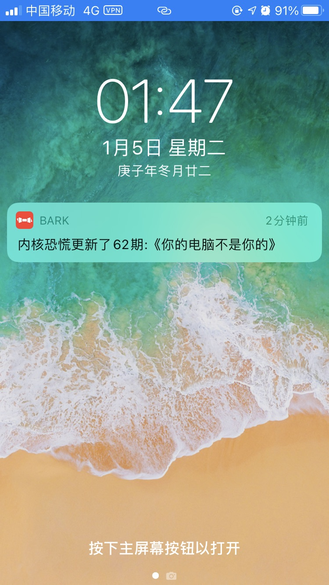
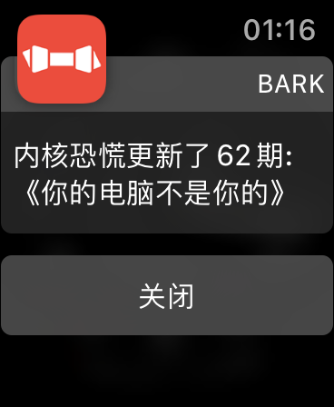

# 内核恐慌更新提醒

一个利用 `bark`推送 `内核恐慌` 更新的消息的小脚本。

### 用法：

1. 将 `config.sample.php` 复制为 `config.php`,将 `YOUR_KEY` 替换成你的 `bark` 密钥。

2. 加入定时任务, 这里每10分钟检测一次，可自行设置频率。

``` bash
*/10 * * * *   /usr/bin/php /web/cmd/bark-pan-icu/run.php >/dev/null 2>&1
```

### 通知效果

- iPhone :



- Apple Watch:

